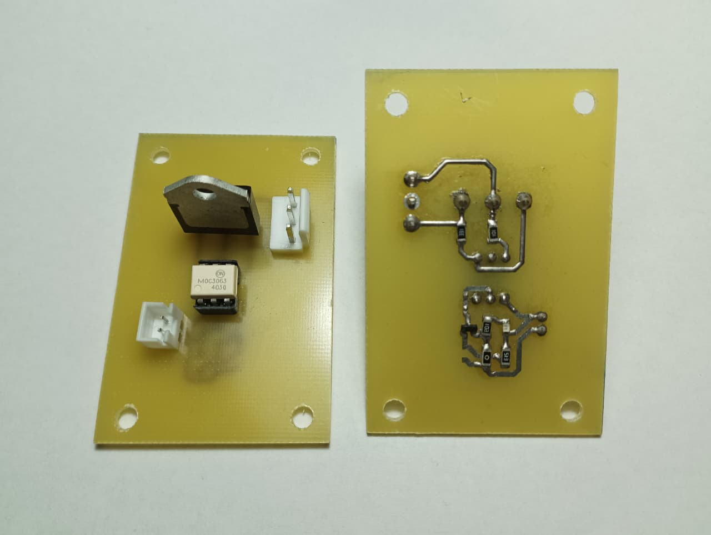
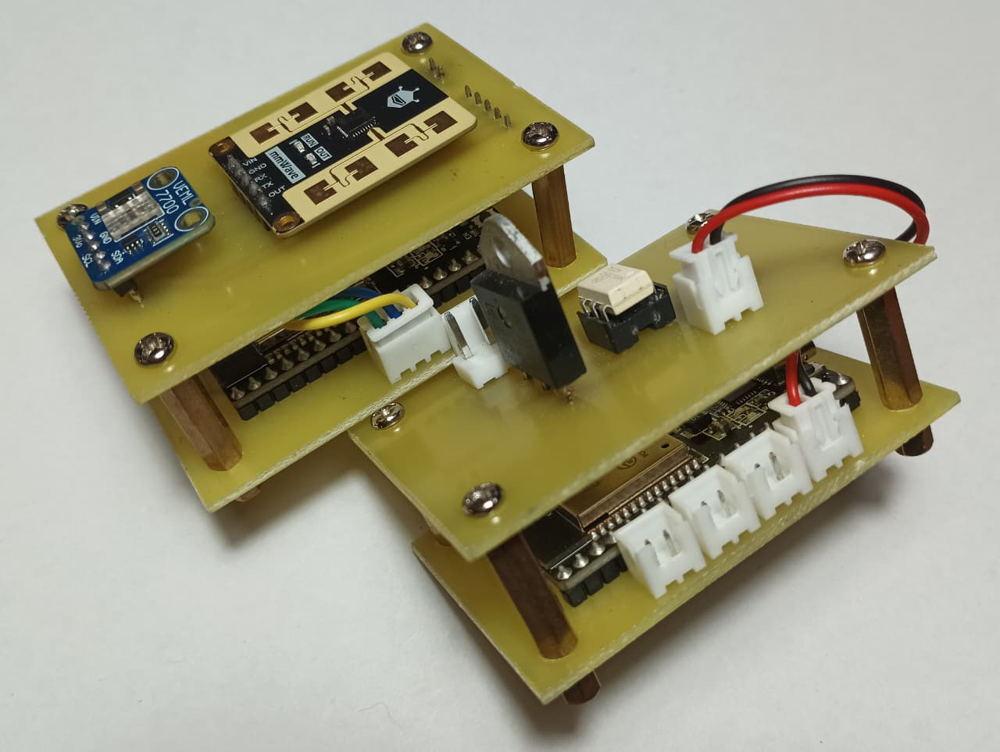
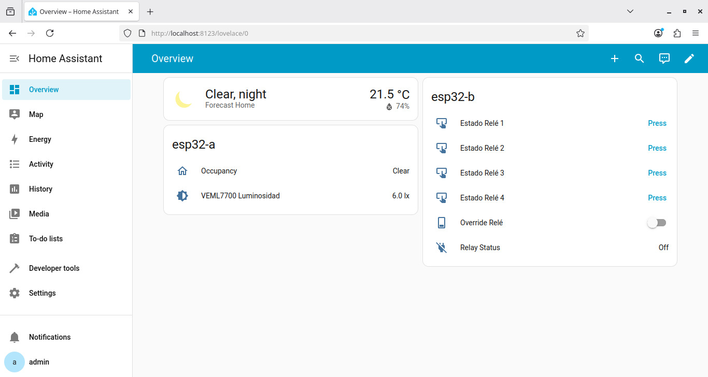
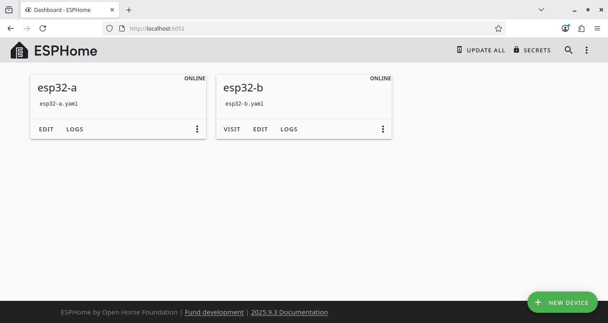

# Sistema IoT descentralizado con ESP32 y ESP-NOW

Sistema de automatización doméstica diseñado para operar de forma autónoma,
segura y tolerante a fallos, utilizando comunicación peer-to-peer entre nodos
ESP32 mediante ESP-NOW, sin dependencia de red Wi-Fi ni broker central.

## Arquitectura general

El sistema está compuesto por nodos ESP32 que toman decisiones localmente y
se comunican entre sí mediante ESP-NOW. La supervisión mediante Home Assistant
es opcional y no afecta la operación del sistema ante caídas de red o servidor.

## Flujo de funcionamiento

1. El nodo sensor detecta presencia mediante radar mmWave.
2. Se evalúa la luminosidad ambiente.
3. Si se cumplen las condiciones, se envía un token de acción vía ESP-NOW.
4. El nodo actuador conmuta la carga y confirma la acción localmente.

## Notas de diseño e iteraciones

Durante el desarrollo del nodo actuador se realizaron varias iteraciones en el
diseño del SSR, motivadas por pruebas prácticas y validación experimental del
comportamiento del circuito.

> En la imagen se observan dos PCBs del SSR diseñado en KiCad: una vista frontal
> y una vista posterior.

En la cara posterior se aprecia la etapa de control basada en un transistor,
cuya resistencia en la base permite regular la amplificación de corriente en el
colector, junto a un LED indicador conectado en paralelo para señalización de
activación.
El emisor del transistor se conecta a tierra mediante un bypass implementado
con una resistencia de 0 Ω.

Esta configuración permite limitar la corriente suministrada al optoacoplador
(MOC), evitando la sobrecarga de los pines GPIO del ESP32 y manteniendo corrientes
de activación seguras, cercanas a los 9 mA por cada SSR activo.

### Desarrollo del SSR

El diseño inicial del SSR se basó en ingeniería inversa de un módulo comercial
capaz de operar con tensiones de control en un rango amplio (aprox. 3 V a 32 V).
Si bien el principio de funcionamiento era correcto, la reproducción directa
del diseño no resultó funcional al implementarse en una PCB propia, presentando
fallas de activación consistentes durante las pruebas.

Ante este comportamiento, se optó por una solución experimental que permitiera
controlar de forma más precisa la corriente de excitación del optoacoplador (MOC).
Para ello, se utilizó el LED indicador, que opera con corrientes del orden de
microamperes, junto con un transistor conectado en paralelo, actuando como una
etapa de control de corriente hacia el MOC, equivalente a una resistencia
variable, aprovechando las características de ganancia (hFE) del transistor..

Esta solución fue implementada y validada en tres SSR independientes, obteniendo
corrientes de activación muy similares entre unidades, lo que permitió confirmar
la reproducibilidad y estabilidad del enfoque.

Una vez validado el comportamiento del SSR en condiciones reales de carga, el
diseño fue posteriormente simplificado en la versión final, eliminando la etapa
activa cuando fue posible y ajustando la limitación de corriente mediante
resistencias, manteniendo un consumo seguro para los GPIO del ESP32.

### Elección del protocolo de comunicación

Inicialmente se evaluó el uso de MQTT como protocolo de comunicación entre nodos.
Sin embargo, debido a la latencia introducida por el broker y a la dependencia
de red, se optó por migrar a ESP-NOW.

El uso de comunicación peer-to-peer permitió reducir la latencia, eliminar
dependencias externas y garantizar la operación local del sistema ante caídas
de red o del servidor de supervisión.

## Hardware – Implementación real

### Implementación de los nodos

El sistema está compuesto por dos ESP32 independientes que se comunican entre sí mediante ESP-NOW.
Uno de ellos actúa como nodo sensor, equipado con radar mmWave para detección de presencia y un sensor de luminosidad.
El segundo funciona como nodo actuador e integra un SSR diseñado en KiCad para el control seguro de carga eléctrica.

### Home Assistant

Home Assistant se utiliza como capa de supervisión y control manual (override),
sin actuar como punto único de fallo del sistema.

> Las capturas de pantalla corresponden al servidor de Home Assistant
> ejecutándose en Docker sobre un MacBook Air A1465 utilizado como host de pruebas.

En el dashboard, el nodo **esp32-a** corresponde al nodo sensor, donde se
visualiza el estado de presencia detectada y el nivel de luminosidad ambiental
medido en lux.

El nodo **esp32-b** corresponde al nodo actuador. Desde este se permite el
control manual de hasta cuatro SSR independientes cuando el modo *override*
está habilitado. En modo automático, los SSR se activan de forma simultánea
cuando el nodo sensor (**esp32-a**) envía un token de activación al detectar
presencia bajo condiciones de baja luminosidad.

Los SSR permanecen activos mientras se mantenga la detección de presencia en
la habitación, desactivándose automáticamente al cesar dicha condición.

### ESPHome

ESPHome se emplea para la configuración y el monitoreo de los nodos ESP32.

## Tecnologías aplicadas
ESP32 | ESPHome | ESP-NOW | Home Assistant | Docker | Debian 12 | KiCad | YAML
