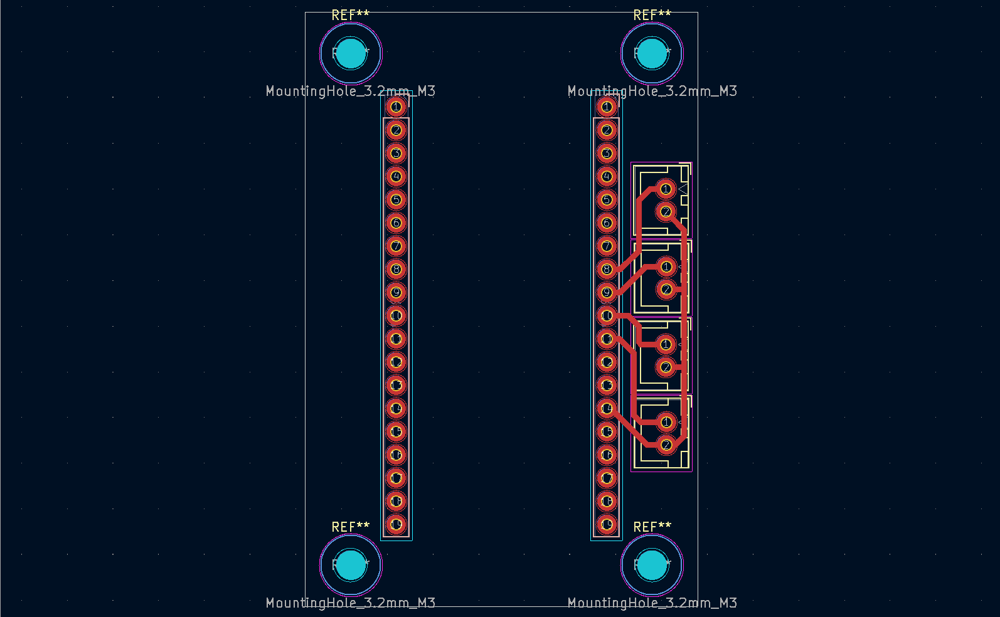

## Diseño PCB

Este diseño corresponde al nodo actuador y fue desarrollado únicamente a
nivel de layout PCB, sin una representación formal de esquemático.

La placa fue diseñada tomando como referencia las dimensiones físicas y
disposición de pines del NodeMCU (ESP32), actuando como una base de
interconexión para el control de hasta cuatro SSR externos previamente
diseñados.

En el PCB se exponen directamente los siguientes pines del ESP32:
- **GPIO33**
- **GPIO25**
- **GPIO26**
- **GPIO27**

Cada uno de estos GPIO está destinado al control de un SSR independiente,
permitiendo accionar hasta cuatro cargas de manera simultánea o individual,
según la lógica implementada en el firmware.

El nodo actuador no requiere conexión física con el nodo de sensores, ya
que la comunicación entre ambos se realiza de forma inalámbrica mediante
ESP-NOW, manteniendo el desacoplamiento funcional y físico entre sensado
y actuación.