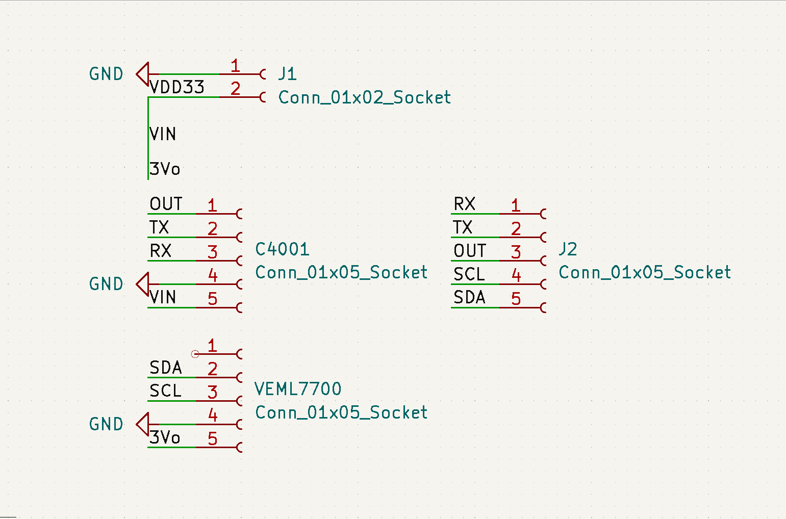
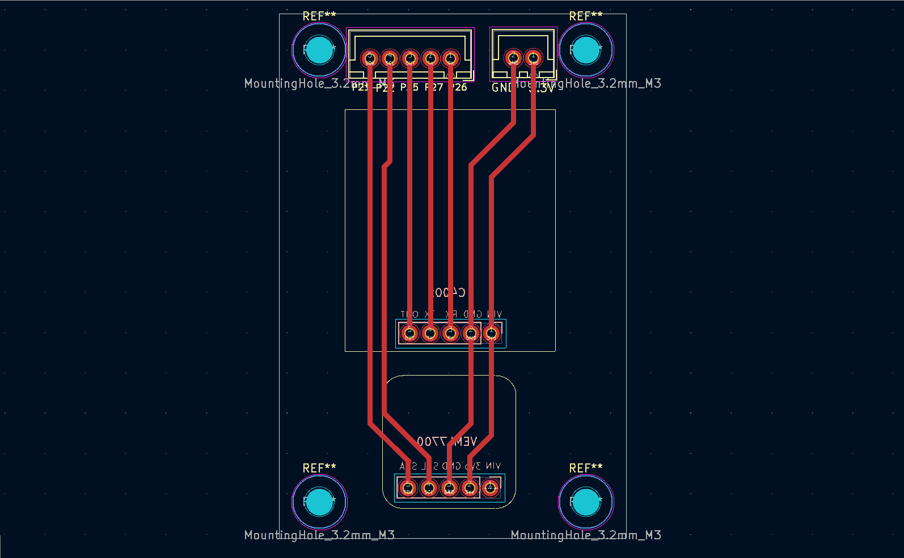

## Diseño PCB

Esta placa corresponde a una placa de sensores dedicada, no a un nodo
independiente. Su función es alojar, alimentar y exponer las señales de los
sensores hacia una placa principal basada en ESP32 (NodeMCU).

El diseño integra un radar de presencia mmWave C4001 y un sensor de luminosidad
VEML7700, sin lógica de procesamiento propia. Ambos dispositivos son
alimentados directamente desde el pin de 3,3 V del ESP32, al cual esta
placa se conecta mediante un conector dedicado.

La placa actúa como interfaz eléctrica y mecánica entre los sensores y el
ESP32, dejando disponibles las siguientes señales:
- RX / TX para la comunicación con el radar mmWave.
- I²C (SDA / SCL) para el sensor de luminosidad.
- Alimentación y referencia a tierra comunes.

Este enfoque modular permite:
- Separar físicamente los sensores del microcontrolador.
- Facilitar pruebas, reemplazo de sensores y futuras iteraciones.
- Mantener el PCB del ESP32 libre de componentes específicos de sensado.

El PCB fue diseñado en KiCad y pensado para prototipado rápido mediante
fresado CNC.