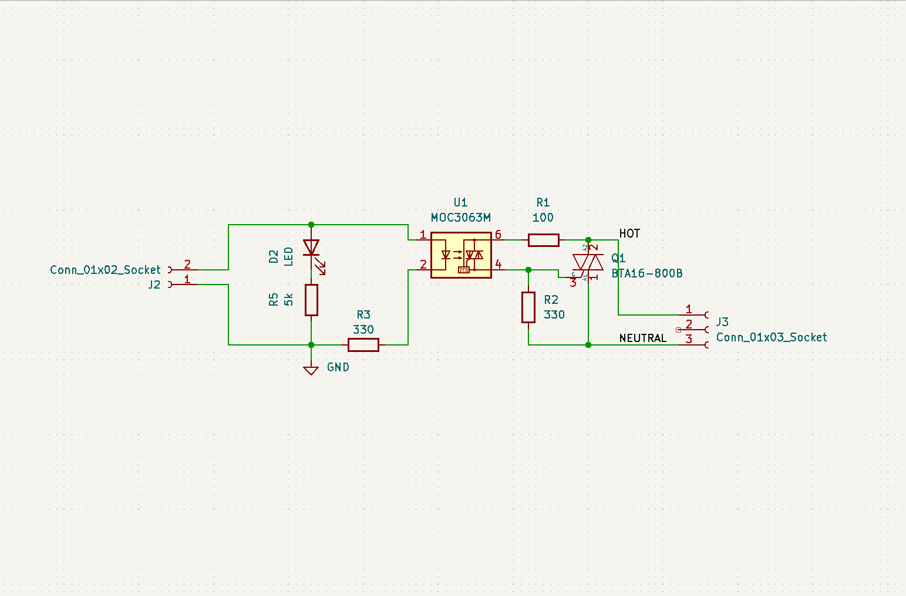
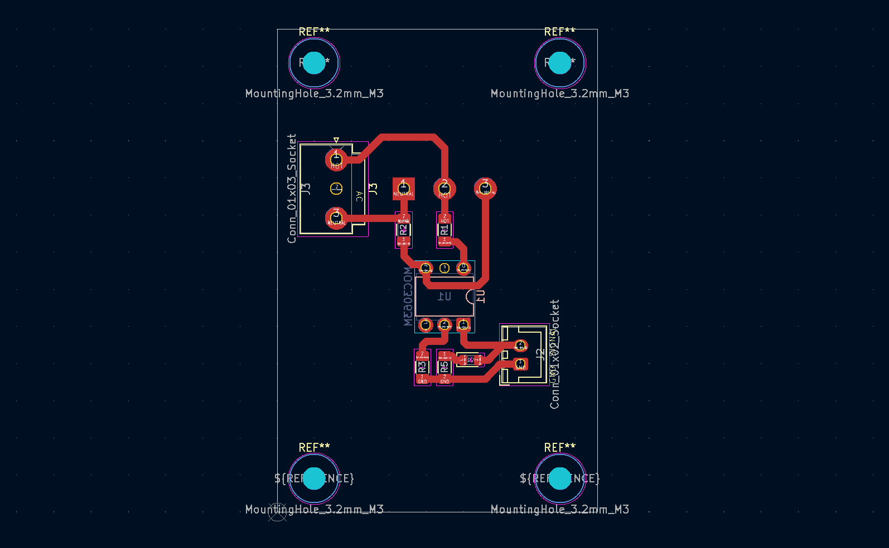

## Diseño PCB

> **Nota sobre el esquemático final**  
> El esquemático y la vista PCB del SSR incluidos en este repositorio
> corresponden a una versión posterior del diseño y no coinciden
> exactamente con la implementación física utilizada en los prototipos
> funcionales.
>
> La PCB mostrada en el README principal corresponde a una versión
> preliminar validada experimentalmente, que incorpora una etapa de
> control basada en un transistor para limitar la corriente de excitación
> del optoacoplador (MOC).
>
> La versión documentada en este directorio refleja una iteración
> simplificada del diseño, donde la limitación de corriente se realiza
> exclusivamente mediante una resistencia en serie, manteniendo un LED
> indicador conectado en paralelo.
